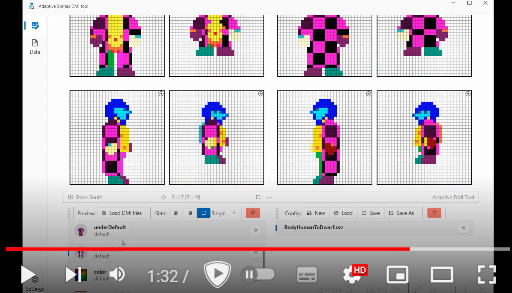

<h1 align="center">
  
   
  Adaptive DMI Tool
</h1>

#   
#  
#  

<h1 align="center">
!!!!!!! This is a BETA program !!!!!!!!
</h1>
<h3 align="center">
The tool is under development, there are inconveniences and bugs.
</h3>
Known issues:

- No support for any resolution except 32x32
- There is no empty workspace and methods for cleaning it (plans to fix)
- There is no saving of the workspace and settings.
- There is no ability to set a suffix and prefix to each state and file if necessary.
- There is no REDO hotkey.
- Inconvenient location of windows (at the moment, the interface is being improved)
- It is necessary to add a button to invert the parallel state for the config
- After saving, the parallel state starts showing an alternative reality when mirroring (how can that be...). 
- - A rare bug that occurs if you do the save incorrectly. I'm trying to find out how it's called (it's called when all the configs have been removed and resaved. A very strange and annoying bug =/

#   
#  
#  

README Available languages:

[English](https://github.com/PhantornRU/AdaptiveSpritesDMItool/blob/main/README.md)

[Russian](https://github.com/PhantornRU/AdaptiveSpritesDMItool/blob/main/README-ru.md)

# Tool for adapting .dmi files
This tool is designed to edit .dmi files with the potential to adapt them to any shape, size, offsets and other parameters imposed on all selected files through the config editor, storing tabular pixel data and their offsets.
Sprite displacement configuration tool to statically create sprites based on those configs.

## The following were used for implementation:
* Interface [WPF](https://github.com/dotnet/wpf) framework.
* Framework for processing DMI files [DMI Sharp](https://github.com/bobbah/DMISharp)

## Usage

### Demo-Video

### Pages
The program has 3 pages:
* Home - [WIP] Page for working with the workspace, saving the latest user settings, loading presets.

* Edit - Page for editing configs by changing pixels on preview canvases.
* Data - Page for processing files for selected configs.

### Home
[WIP]

### Edit

1 - Page selection

2 - Toolbar, buttons for interaction and editing PREVIEW. Editing, deleting, changing mode (parallel), grid, overlay. Toolbar tools may not be fully displayed, you can display full tools by expanding the window or clicking on the "check mark" button in the drop-down on the right.

3 - Preview image displaying all edited sprites for configs, overlays (editable images), previews (left non-editable image) and landmarks (right non-editable image).

4 - Status bar information of the mouse located on top of the preview windows.

5 - Window for loading DMI files and selecting DMI States from them to display on top. You can configure on top of which preview the state will be displayed.

6 - Window for saving and creating new configs.

Here you can:

- Create a new config (DO NOT FORGET SAVE IT)

- Load an existing config

- Save the current config

- Save the current config as a new file.

When you select a config, it is superimposed on the preview.

  
  
### Data

1 - Displays all files loaded from the "Import" directory for processing in the Export folder.

- The "Override" button will switch the mode of overwriting similar files in the Export directory.

2 - Displays the states of the selected .dmi file

3 - Panel for selecting a config for processing all files. You can select several configs at once. The config name will be used as the name of the new folder in the Export directory.

4 - Setting the paths of the Import and Export directories. By default, files will be processed in the folder of the working build.

5 - Loading bar showing how many files have already been processed.

6 - Button for processing all files under the selected configs.

After pressing - wait for it to complete.

All processed files will be exported to Directory/"Config Name"/

  

## Delelopment
The program is divided into controllers, resources, models and auxiliary classes for more convenient access to the code. Inside the code there are divisions into regions for even more convenient navigation and separation.

### For .NET 7
These tool require Visual Studio 2022(v17.7), Visual Studio 2022 for Mac (v17.6) to build, test, and deploy, and also require the .NET 7 SDK.

[Get a free copy of Visual Studio 2022 Community Edition](https://www.visualstudio.com/wpf-vs)

[.NET 7 SDK](https://dotnet.microsoft.com/en-us/download/dotnet/7.0)

### View Models
In addition to Views that contain WPF pages, they use:
* Dashboard View Model - [WIP]
* States Editor View Model - a model for implementing changes to config selection, preview states, working with files and loading them, saving configs and storing State Item's.
* Data View Model - a model for implementing changes to the selected config, displaying Tree View with all selected files that will be displayed and processed in the future.
* Settings View Model - a model for settings of the current theme.
* Main Window View Model - a model for navigating through pages.

### Models
* Config Item - a model for a config that stores the path to a table for quick access.
* State Item - a model for a state with a .DMI file that stores a preview, path, file name and state name.
* Data Image State - a model for working with preview images that superimpose "preview, landmark and overlay" states on top of each other for further visualization.
* State Edit Type - model of enumeration of various types:
** StateEditType - Editing mode of the main preview window
** StateQuantityType - Type of state editing.
** StateImageType - Type of preview element.
** StateImageSideType - Side of the preview element.
** SelectMode - Current mode of the pixel moving tool.
** StatusBarType - Type of the status bar element.
** StatePreviewType - Selected preview type for overlaying states.

### Controllers
* Environment Controller - Workspace and environment initialization controller.
* Draw Controller - Image processing controller that stores all functions for drawing on the canvas and editing pixels.
* Editor Controller - Controller of current canvas editing modes and button logic.
* Mouse Controller - Controller for processing pressed mouse buttons and finding the cursor position on the canvas.
* Buttons Controller - Controller for processing pressed keys, hotkeys.
* States Controller - Controller that stores information about current states, modes, configs and statuses of elements used by the entire program.
* Status Bar Controller - Controller of information displayed on the status bar.

### Processors
DMI State Processor - File processor from these states for selected configs.

### Helpers
Image Encoder - DMI State processor in Writeable Bitmap for display and editing on the "Edit" page.
Files Searcher - Search engine for the correct directory.

## Contact
Questions or want to help with the implementation? You can contact me on discord: **PHANTOMRU** (don't confuse the nickname on GitHub, there "m == rn" xdd)

# License
Unless otherwise mentioned, the samples are released under the [MIT license](https://github.com/PhantornRU/AdaptiveSpritesDMItool/blob/main/LICENSE)
